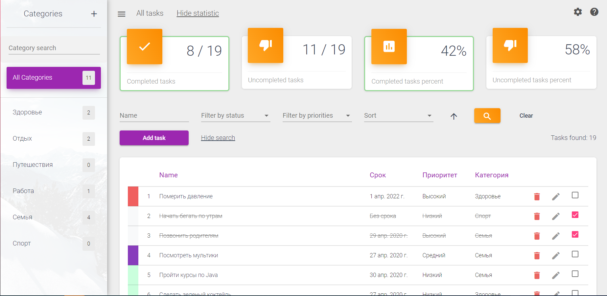
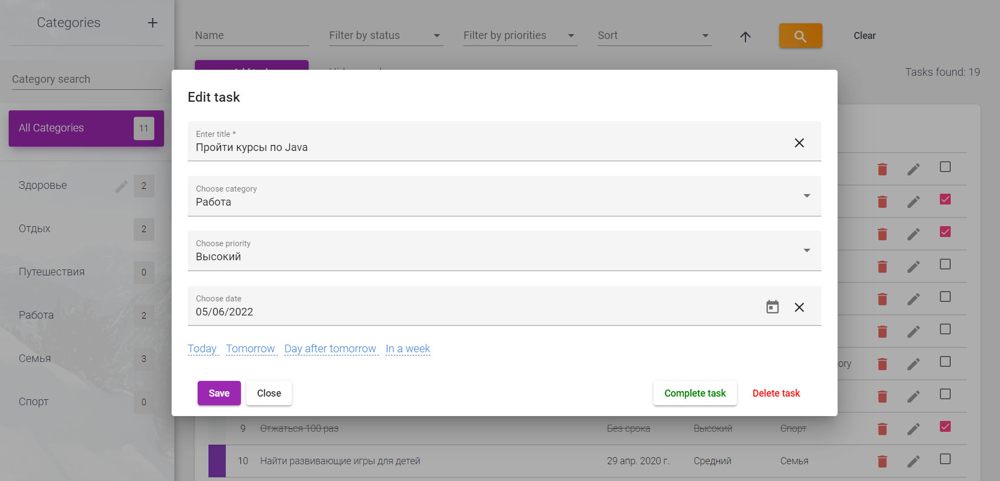
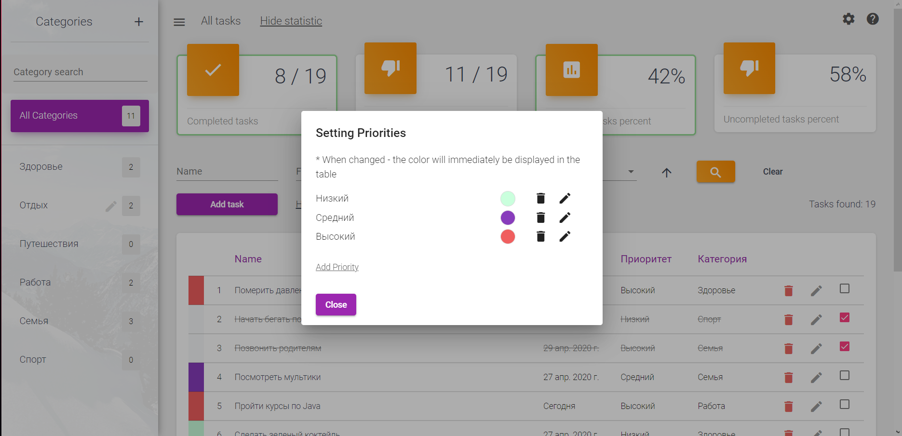

# Todo
My First Angular Project. It's a traditional Todo app with task management features. A simple and clear interface provides convenient operation.

## Main Technologies used:
- Backend: Spring Boot
- View: Angular
- Database management system: MySQL

## Main functionality:
- Create/update/delete tasks.
- Create/update/delete categories.
- Create/update/delete priorities.
- Search tasks by name, as well as filters by categories and by priorities.

## Get Started:
- Run Frontend Module (https://github.com/LiliaPohorielova/todo-frontend)
- Run Backend Module (https://github.com/LiliaPohorielova/todo-backend)
- Go to (http://localhost:4200)

## Images

